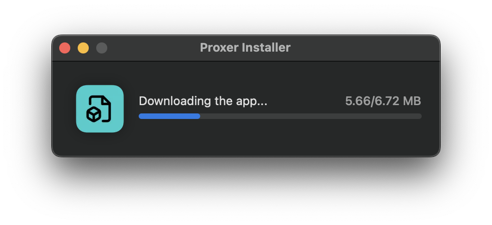

# Mac Installer

Создайте в 1 клик установщик для вашего macOS приложения. Избавьте пользователей от когнитивной нагрузки при выборе файла для их типа процессора (x86_64 или arm64), обеспечив простоту установки.



## Демо-видео
https://youtu.be/KyJ4SOSBmaM

## Возможности

- Поддержка 2 вариантов источников для загрузки файлов приложения: GitHub Releases и прямые ссылки (Direct URLs)
- Локализация на 14 языках: английский, болгарский, китайский (упрощённый), французский, немецкий, хинди, итальянский, японский, корейский, португальский, русский, испанский, турецкий, вьетнамский
- Установщик не скачивает файлы приложения, если оно уже установлено на устройстве пользователя
- Запрос подтверждения при выходе из установщика во время загрузки или установки

## Подготовка перед сборкой установщика

> [!IMPORTANT]
> Требуется Xcode 26+, т.к. используется новый тип иконок `*.icon` через Icon Composer.

Клонируйте репозиторий проекта:

```bash
git clone https://github.com/doroved/mac-installer.git
cd mac-installer
```

Перейдите в настройки проекта (Xcode) и внесите следующие изменения:
1. `General` → `Display Name` — замените `AppName` на название вашего приложения
2. `Signing & Capabilities` → `Bundle Identifier` — замените `com.appname.installer` на уникальный идентификатор для вашего установщика

В файле `AppConfig.swift`:

1. Укажите название вашего приложения в `appName` так, как оно отображается в `/Applications`
2. Выберите способ загрузки файла приложения (`downloadType`):
   - `github` — для загрузки с GitHub Releases
   - `direct` — для прямой загрузки по URL
3. Укажите URL для `latestReleaseURL`, `arm64URL`, `x86_64URL` в зависимости от выбранного способа загрузки

В `Assets.xcassets` замените иконку на иконку вашего приложения.

## Сборка установщика

1. Перейдите в `Product` → `Archive` для создания архива проекта
2. После создания архива нажмите кнопку `Distribute App`, выберите `Direct Distribution` и нажмите `Distribute`
3. Дождитесь завершения процесса и нажмите `Export` для сохранения установщика в виде файла `.app`

## Референс

- [Spotify Installer](https://download.scdn.co/SpotifyInstaller.zip)
